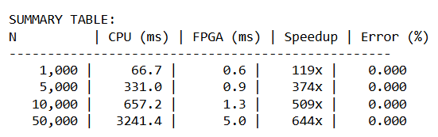

# FPGA-Accelerated Monte Carlo Option Pricing

This project implements a Monte Carlo simulation for European option pricing on both CPU and an FPGA, using a custom hardware kernel to accelerate the payoff computation. The goal is to compare numerical accuracy and speedup between a standard Python/NumPy implementation and an FPGA design deployed on a PYNQ-Z2 board.

## Features

- Monte Carlo pricing of a European call option using pre-generated standard normal samples.
- FPGA kernel written in C++ for Vitis HLS, with pipelined and parallel (multi-lane) payoff computation.
- PYNQ-based Python host code to load overlays, manage buffers, launch the kernel, and measure speedup versus CPU.
- Graph and table for performance comparison

## Requirements
- PYNQ-Z2 (or compatible Zynq-7000) FPGA board with PYNQ image installed.
- Xilinx Vivado and Vitis HLS
- Python environment on the board with pynq, numpy, and matplotlib for host-side experiments

## Results
- In general, FPGA achieves large speedups (hundreds of times faster) compared with the single-threaded CPU baseline
- Speed is directly proportional to N
- Option prices from the FPGA closely match the CPU Monte Carlo estimates, with any remaining difference mainly due to floating-point accumulation order and choice of exponential implementation.

- 
- 
